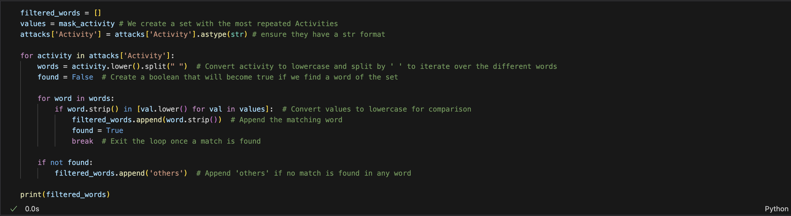

# A Shark's Guide to Gourmet Dining

## Overview
In this project, I will be diving into world-while shark attack data with the goal: to create a guide for sharks, helping them find the best places and times to have the tastiest meals. By studying when and where shark attacks happen, as well as what the victims were doing, we'll uncover patterns to help sharks make better dining choices. Our aim is to provide insights that will help sharks find their favorite meals while also promoting ocean safety for humans.

## Requirements/Libraries
Code was written in Python using Jupyter Notebook and Visual Studio Code. 
Libraries used:
    
    - Pandas
    - Numpy
    - Regex
    - Matplotlib
    - Seaborn
    - Plotly
  
    

## Hypotheses

- `Hypothesy 1`: **Surfers are the most vulnerable to attacks:** Sharks find it easier to prey on surfers due to their active movements and proximity to the ocean's surface, making them more accessible targets.

- `Hypothesy 2`: **Swimmers present a tougher challenge than surfers:** While reaching people swimming may require sharks to venture closer to the coast, once within range, they provide a more substantial meal compared to surfers, who may only offer an apetizer.

- `Hypothesy 3`: **Breakfast time may be prime dining hours:** With more people engaging in sports activities during the morning, sharks may have a higher chance of encountering potential prey, leading to increased feeding opportunities.

- `Hypothesy 4`: **Advanced age increases vulnerability:** Older individuals may be more susceptible to shark attacks due to potential mobility limitations and decreased ability to evade or defend against predators.

# Workflow

**Step 1: Data Preparation**
- Clean and prepare the dataset.
- Address missing or inconsistent data.
- Standardize formats and perform necessary transformations.

**Step 2: Hypothesis Testing**
- Formulate hypotheses.
- Conduct statistical analysis.
- Interpret results to test hypotheses.

**Step 3: Visualization and Conclusion**
- Create visual graphics.
- Extract insights from visualizations.
- Summarize findings and draw conclusions.

# Data Cleaning

#### First Attempt
- Delete duplicated 19.418 duplicated rows
- Exanime Nulls (clean all nulls values) -> first subset ended with a df.shape (6305, 16)

#### Second attempt
- Analyse data from the requiered study variables
  - Nulls
  - Data formats

This second Step is one of the most important one as I'm preparing the final subset, by cleaning and transforming the most important variables:
   - Activity
   - Age
   - Time
   - Fatal (Y/N)

I will present an overview of the main cleaning methods used

### Activity variable
- Analyse the different values we have for Activity
- Create a variable with the Activities that are repeated more than 10 times
- Convert activity to lowercase and split by ' ' to iterate over the different words
- Append the matching word

- Create a new column with the filtered activities
- I do a mapping that groups similar activities into the most common ones

### Age variable
This column has diverse data formats

  - "Teen", "Adult"
  - "60s"
  - "9 months"
  - "2 to 3 months"

I take different approaches to each of them.
1. I do a mapping for those values that are using a string to show a Age. (Teen, Adult, etc)
2. I use Regex, for values that comprenhend between a range of Age, 40 - 50, or that have no digits.

### Time variable
This variable pecualiarity is that there are hours format like 14h30
1. To clen it in the most efficient way I create a function that takes the 5 characters after the first number is found.

2. In order to have more flexibility I change the format to integers by droping the "h" and only keeping the first two digits

### Subset Result

My cleaned attacks data frame has a shape (1689, 8)

# Hypothesis Analysis

### `Hypothesy 1`: Surfers are the most vulnerable to attacks
Do sharks find it easier to prey on surfers due to their active movements and proximity to the ocean's surface, making them more accessible targets?

- By grouping the number of attacks during the last 8 years of the df, we see how surfers are the ones most attacked with a huge different (more than double)

### `Hypothesy 2`: Swimmers present a tougher challenge than surfers

While reaching people swimming may require sharks to venture closer to the coast, once within range, do they provide a more substantial meal compared to surfers, who may only offer an apetizer?

- To have a better view I have divided the Activities in two types: Sports or Recreative activities.
- We confirm that the most attacked people are the ones practicing a sport

- However the Fatality rate is higher for recreative activity. Giving us a point to justify our hypothesis. 

### `Hypothesy 3`: Breakfast time may be prime dining hours

With more people engaging in sports activities during the morning, sharks may have a higher chance of encountering potential prey, leading to increased feeding opportunities.

- With this two graphs we can see how the are more attacks produced during the day, but actually the best time for a Shark to eat is in the Afternoon.

### `Hypothesy 4`: Advanced age increases vulnerability
Are older individuals more susceptible to shark attacks due to potential mobility limitations and decreased ability to evade or defend against predators?

- This graph presents a lot of information by displaying the different age distribution, grouping the data by each activity and confirming the Age rate with most Fatality cases.
- Surfing is the activity with more attacks
- Swmming has the wider age distribution with the oldest people attacked.
- However the sports with the highest Age avg are diving and kayaking. 
 - We can see a correlation of more death in this two sports as age is higher

# Final Conclusions

The final conclusions to this Shark's Gourmet dining Guide are:

1. Eventhough eating someone that is swimming instead of surfing is a bigger banquete the probabilities of getting to it are lower

2. The shark will have to decide weather eat three arms and one leg or go for the big price

3. The best time for a good meal is in the afternoon. Between 13:00h and 16:00h.

4. The older the prey the easier the prize
